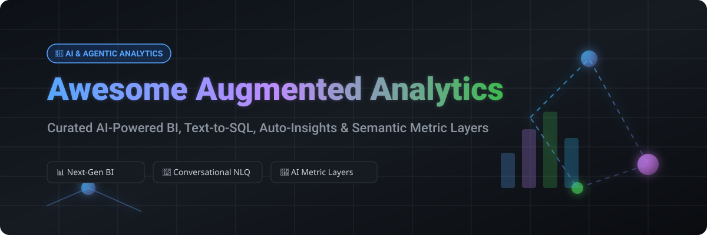

<div align="center">

<a href="https://github.com/ishandutta2007/Awesome-Awesome-Awesome"></a><a href="https://discord.gg/jc4xtF58Ve"></a> <a href="https://github.com/ishandutta2007/Awesome-Augmented-Analytics/stargazers"></a> <a href="https://github.com/ishandutta2007/Awesome-Augmented-Analytics/network/members"></a> <a href="https://github.com/ishandutta2007"></a>

<br />



# 🚀 Awesome Augmented Analytics

**Curated List of SaaS Platforms & Open-Source Projects for AI-Assisted Business Intelligence, Natural Language Query (NLQ), Auto-Insights, Metric Semantic Layers & Agentic Analytics**

*Last updated: September 2026*

</div>

---

## 💡 Overview & SEO Summary

**Augmented Analytics** represents the next generation of Business Intelligence (BI) and data analytics, combining artificial intelligence (AI), machine learning (ML), large language models (LLMs), and automated metric layers. These tools enable business users, data analysts, and analytics engineers to ask natural language questions (Text-to-SQL), discover automated root-cause insights, perform anomaly detection, and generate executive summaries without writing complex SQL queries manually.

Whether you are evaluating commercial enterprise copilots like **Microsoft Power BI Copilot**, **Tableau Pulse**, and **ThoughtSpot**, or building self-hosted agentic stacks using **Apache Superset**, **Metabase**, **Cube**, **Vanna AI**, and **Lightdash**, this curated list tracks the top solutions across the ecosystem.

---

## 📑 Table of Contents

- [📊 SaaS & Hosted Enterprise Platforms](#-saashosted-enterprise-platforms)
- [🔓 Open-Source GitHub Projects](#-open-source-github-projects)
- [🛠️ Architectural Patterns & Building Blocks](#%EF%B8%8F-architectural-patterns--building-blocks)
- [🤝 How to Contribute](#-how-to-contribute)
- [🛡️ Disclaimer](#%EF%B8%8F-disclaimer)
- [📈 Star History](#-star-history)
- [💖 Support & Sponsorship](#-support--sponsorship)

---

## 📊 SaaS/Hosted Enterprise Platforms

**Market Overview:** The global Augmented Analytics market size is estimated at **$36B – $41B in 2026** (projected to reach $127B–$300B+ by 2033–2035 at ~26% CAGR) and exhibits a **moderately fragmented / medium-concentration** structure, where major enterprise cloud giants compete alongside specialized AI analytics platforms.

| Product | Company Size / Valuation | Starting Tier Price | Free Tier / Trial Limit | Key Features & Capabilities |
|---|---|---|---|---|
| 🤖 **[Microsoft Power BI Copilot](https://powerbi.microsoft.com/)** | **$3.1 Trillion** (Market Cap) | $10 / user / month (Pro tier) | **Free Forever** (Desktop edition); 60-day trial for Fabric/Pro cloud features | Copilot AI narrative reports, DAX generation, integration with Microsoft 365 & Fabric |
| ☁️ **[Oracle Analytics Cloud](https://www.oracle.com/analytics/)** | **$380 Billion** (Market Cap) | $16 / user / month (Professional Edition) | **30-day trial** ($300 cloud credits) + Always Free tier (2 Autonomous DBs) | Auto-insights, natural language generation (NLG), automated data preparation, enterprise ML |
| 📊 **[Tableau Pulse (Salesforce)](https://www.tableau.com/)** | **$260 Billion** (Market Cap) | $15 / user / month (Viewer tier) | **14-day trial** (Full Tableau Cloud & Pulse metric tracking access) | AI-driven metric summaries, natural language Q&A, automated digest notifications |
| 🏢 **[SAP Analytics Cloud](https://www.sap.com/products/technology-platform/cloud-analytics.html)** | **$250 Billion** (Market Cap) | $36 / user / month (Standard Business User) | **90-day trial** (Up to 5 users, 10 GB data storage limit) | Joule AI copilot, predictive forecasting, enterprise smart discovery, planning integration |
| ❄️ **[Sisu Data (Snowflake)](https://www.sisudata.com/)** | **$50 Billion** (Market Cap) | $2.00 / credit (Pay-as-you-go Cortex credits) | **30-day trial** ($400 free Snowflake credits) | Automated root-cause analysis, key driver exploration, high-cardinality SQL analytics |
| 🧠 **[Qlik AutoML & Sense](https://www.qlik.com/)** | **$10 Billion** (Valuation) | $20 / user / month (Standard tier, 10-user min) | **30-day trial** (Qlik Cloud Business, 5 users, 25 GB data limit) | Automated machine learning, generative AI insight advisor, associative analytics engine |
| 🔍 **[ThoughtSpot](https://www.thoughtspot.com/)** | **$4.5 Billion** (Valuation) | $25 / user / month (Essentials tier) | **14-day trial** (Full search-driven analytics & Liveboard access) | Search-driven NLQ, Spotter AI agents, automated anomaly detection on governed warehouses |
| 🧩 **[Sisense Fusion](https://www.sisense.com/)** | **$1.1 Billion** (Valuation) | $833 / month ($10,000 / year base platform) | **30-day trial** (Full sandbox environment with sample & live data connectors) | Embedded AI analytics, natural language query, custom AI model integration, proactive alerts |
| ⚡ **[Domo AI](https://www.domo.com/)** | **$350 Million** (Market Cap) | $300 / month (Standard tier) | **Free Forever plan** (Up to 300 credits/month, unlimited users) | DomoMind AI chat, automated data pipelines, interactive dashboards, real-time alert triggers |
| 🎯 **[Tellius](https://www.tellius.com/)** | **$100 Million** (Valuation) | $1,500 / month (Professional base tier) | **14-day trial** (Full access to search & automated driver analysis on custom data) | Decision intelligence, why-change diagnostic analytics, natural language search over SQL |

---

## 🔓 Open-Source GitHub Projects

Below are top open-source projects providing self-hosted BI, AI agent frameworks, text-to-SQL engines, and universal metric layers for augmented analytics. *Sorted by GitHub Star Count (Descending).*

1. **[Apache Superset](https://github.com/apache/superset)** [](https://github.com/apache/superset/stargazers)  
   ⚡ *Enterprise open-source data exploration & visualization platform with SQL IDE, interactive dashboards, and growing LLM plugin integration.*

2. **[Metabase](https://github.com/metabase/metabase)** [](https://github.com/metabase/metabase/stargazers)  
   🎯 *Leading self-service open BI platform with visual query builder, automated charting, and AI assistant capabilities for business users.*

3. **[OpenBB](https://github.com/OpenBB-finance/OpenBB)** [](https://github.com/OpenBB-finance/OpenBB/stargazers)  
   📈 *Open-source investment research, financial analytics, and copilot agent infrastructure connecting multi-asset data sources.*

4. **[Redash](https://github.com/getredash/redash)** [](https://github.com/getredash/redash/stargazers)  
   📊 *Open-source data visualization and SQL query platform designed for collaborative dashboarding and data sharing.*

5. **[DuckDB](https://github.com/duckdb/duckdb)** [](https://github.com/duckdb/duckdb/stargazers)  
   🦆 *High-performance in-process analytical SQL database engine powering ultra-fast local augmented analytics and interactive notebook workflows.*

6. **[Cube](https://github.com/cube-js/cube)** [](https://github.com/cube-js/cube/stargazers)  
   🧊 *Universal semantic layer and data model API powering AI agents, LLM text-to-SQL context, and governed metrics.*

7. **[DB-GPT](https://github.com/eugeneyan/open-source-bi)** [](https://github.com/DB-GPT/DB-GPT/stargazers)  
   🤖 *AI-native data app development framework featuring Multi-Agent RAG, text-to-SQL engines, and privacy-first database assistants.*

8. **[Vanna AI](https://github.com/vanna-ai/vanna)** [](https://github.com/vanna-ai/vanna/stargazers)  
   💬 *Open-source RAG-based Python framework for precise text-to-SQL generation and conversational database querying.*

9. **[Lightdash](https://github.com/lightdash/lightdash)** [](https://github.com/lightdash/lightdash/stargazers)  
   🔥 *Open-source dbt-native agentic BI platform enabling metrics-as-code, automated charts, and Git-driven CI/CD workflows.*

10. **[Evidence](https://github.com/evidence-dev/evidence)** [](https://github.com/evidence-dev/evidence/stargazers)  
    📄 *Code-first, markdown-based framework for building interactive data products and narrative analytics reports.*

11. **[Dataherald](https://github.com/Dataherald/dataherald)** [](https://github.com/Dataherald/dataherald/stargazers)  
    🧠 *Natural language to SQL engine built for enterprise data warehouses with business context learning and query validation.*

12. **[Rill Developer](https://github.com/rilldata/rill)** [](https://github.com/rilldata/rill/stargazers)  
    ⚡ *Fast operational analytics tool paired with DuckDB and Apache Pinot for interactive metric exploration.*

13. **[Helical Insight](https://github.com/helicalinsight/helicalinsight)** [](https://github.com/helicalinsight/helicalinsight/stargazers)  
    🛠️ *Open-source BI framework featuring customizable reporting, embedded analytics, and NLP question-answering modules.*

---

## 🛠️ Architectural Patterns & Building Blocks

Modern Augmented Analytics architecture typically combines three core layers:

```
┌─────────────────────────────────────────────────────────┐
│               1. AI & Conversational UX                 │
│  (Vanna AI / DB-GPT / Copilots / Text-to-SQL Agents)    │
└────────────────────────────┬────────────────────────────┘
                             │
                             ▼
┌─────────────────────────────────────────────────────────┐
│              2. Governed Semantic Layer                 │
│         (Cube / dbt Metric Flow / Lightdash)            │
└────────────────────────────┬────────────────────────────┘
                             │
                             ▼
┌─────────────────────────────────────────────────────────┐
│            3. Cloud Data Warehouse / Engine             │
│    (Snowflake / BigQuery / Databricks / DuckDB)         │
└─────────────────────────────────────────────────────────┘
```

- **Self-service BI**: **Metabase** or **Apache Superset** for business users and interactive dashboards.
- **Metrics + AI Agents**: **Cube** or **Lightdash** paired with **Vanna AI** for schema-aware, governed text-to-SQL.
- **Local & In-Memory Analytics**: **DuckDB** + **Evidence** for code-first narrative reporting.

---

## 🤝 How to Contribute

Contributions are welcome! Please follow these guidelines:

1. Fork this repository.
2. Edit `README.md` keeping descriptions factual, concise, and formatted.
3. For SaaS platforms, include specific starting tier prices, free trial limits, and company valuation.
4. For Open-Source projects, include the proper stargazers link and GitHub star badge.
5. Submit a Pull Request with a short summary of the addition.

*Refer to the main [Awesome List Directory](https://github.com/ishandutta2007/Awesome-Awesome-Awesome) for more curated lists.*

---

## 🛡️ Disclaimer

- This is a **community-curated** list — not exhaustive and not an explicit commercial endorsement.
- AI-generated insights and Text-to-SQL models can produce inaccurate results. Always mandate human review, maintain robust semantic governance, and control data permissions.

---

## 📈 Star History

[](https://star-history.dera.page/#ishandutta2007/Awesome-Augmented-Analytics&type=date&legend=top-left)

---

## 💖 Support & Sponsorship

Thank you for exploring **Awesome Augmented Analytics**! If you find this repository helpful for your data engineering or AI analytics projects, consider supporting it:

- ⭐ **Star this repository** to increase visibility on GitHub.
- 🔀 **Fork & Share** with your colleagues, data team, and analytics communities.
- ☕ **Sponsor the Maintainer**: Support ongoing updates via the [GitHub Sponsor Dashboard](https://github.com/sponsors/ishandutta2007).
